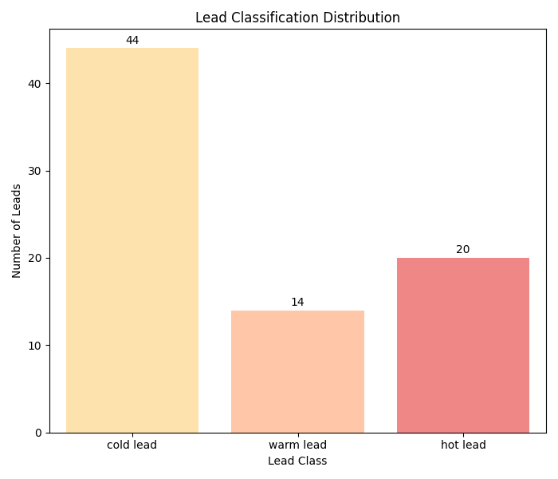

# Lead Scoring Automation

## Overview
This project automates the process of **scoring, classifying, and prioritizing leads** for marketing and sales teams.  
It uses behavioral data, intent signals, and lead source information to generate actionable insights.

The tool is designed for **B2B SaaS and MarTech teams** who want to **focus on high-potential leads**, improve conversion rates, and optimize sales efforts.

---

## Key Features

- **Data Cleaning**
  - Handles missing values, duplicates, and irrelevant columns.
  - Converts numerical columns to appropriate types.

- **Lead Scoring**
  - Behavioral scoring: page views, email opens, time on site.
  - Intent action scoring: activity-based points (downloads, page visits).
  - Lead source scoring: weighted by marketing channel.

- **Lead Classification**
  - Hot, warm, and cold leads based on configurable thresholds.
  - Rules are stored in a `YAML` configuration file for flexibility.

- **Reporting & Export**
  - Exports cleaned and scored leads to CSV.
  - Generates visual charts of lead classification distribution.

---

## Installation

**Requires:** Python 3.10+ (or any Python 3 version compatible with the packages)

1. Clone the repository:

```bash
git clone https://github.com/Laurianne-M/Lead-Scoring-Automation.git
cd Lead-Scoring-Automation
```

2. Install dependencies:

```bash
pip install -r requirements.txt
```
**Dependencies include**
- `pandas` : Data loading, cleaning, processing, and CSV handling
- `pyyaml` : Read YAML configuration files (scoring rules, thresholds)
- `matplotlib` : Generate charts and save lead classification visuals
- `seaborn` : Beautify charts, easier plotting of counts and distributions

---

## Usage

1. Load and Clean Leads

```bash
python cleaner.py
```
- Cleans raw lead CSV files from `data/raw` folder
- Handles missing data and duplicates
- Prepares a processed file for scoring inside `data/processed` folder

2. Score and Classify Leads

```bash
python scorer.py
```
- Applies scoring rules from settings.yaml
- Adds `lead_score` and `lead_class` columns

3. Export Reports

```bash
python exporter.py
```
- Saves scored leads to CSV inside **data/output folder**
- Generates lead classification distribution charts inside **data/output folder**

---

## Configuration

All scoring rules, thresholds, and weights are stored in `settings.yaml` :

```bash
#Intent Action (e.g: if the user requested a demo -> +20 points)
  activity_scores:
    requested_demo: 20
    viewed_page_price: 15
    signed_up: 10
    downloaded_ebook: 5
    clicked_email: 3
    visited_landing_page: 1

# Source-based Scoring (e.g: a linkedin lead have more value than a facebook ads lead)
source_scores:
  linkedin: 10 
  google_ads: 8
  facebook_ads: 6
  tiktok_ads: 5
  organic_search: 4
  referral: 7 
```

Modify these values to adapt to your own marketing strategy.

--- 

## Example Output

1. **Processed CSV Example:**


| Full Name     | Email Address                                                 | Lead Source  | Activity             | Pageviews | Email Opens | Time on Site (seconds) | Lead Score | Lead Class |
| ------------- | ------------------------------------------------------------- | ------------ | -------------------- | --------- | ----------- | ---------------------- | ---------- | ---------- |
| Alex Walker   | [alex.walker@company.com](mailto:alex.walker@company.com)     | google_ads   |                      | 0         | 0           | 0                      | 0          | cold lead  |
| Robin Miller  | [robin.miller@gmail.com](mailto:robin.miller@gmail.com)       |              |                      | 9         | 7           | 0                      | 16         | warm lead  |
| Jordan Hall   | [jordan.hall@gmail.com](mailto:jordan.hall@gmail.com)         |              | visited_landing_page | 5         | 1           | 0                      | 6          | cold lead  |
| Alex Johnson  | [alex.johnson@outlook.com](mailto:alex.johnson@outlook.com)   | facebook_ads | requested_demo       | 0         | 0           | 166                    | 21         | hot lead   |
| Cameron Brown | [cameron.brown@company.com](mailto:cameron.brown@company.com) |              | signed_up            | 12        | 0           | 114                    | 26         | hot lead   |


2. **Lead Classification Chart (e.g for a 100 leads csv file):**



---

## Business Impact

- Prioritize high-value leads automatically
- Reduce wasted sales effort on low-potential leads
- Easy to adjust rules for changing marketing strategies
- Visual dashboards help teams make faster decisions

---

## Contributing

1. Fork the repository
2. Create a new branch: `git checkout -b feature-name`
3. Make your changes and commit: `git commit -m "Add feature"`
4. Push to branch: git push origin `feature-name`
5. Open a Pull Request

---

## License

This project is licensed under the MIT License. See `LICENSE` for details.